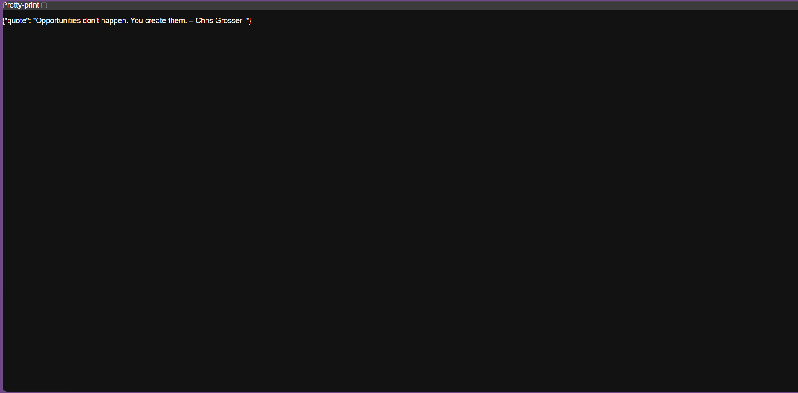
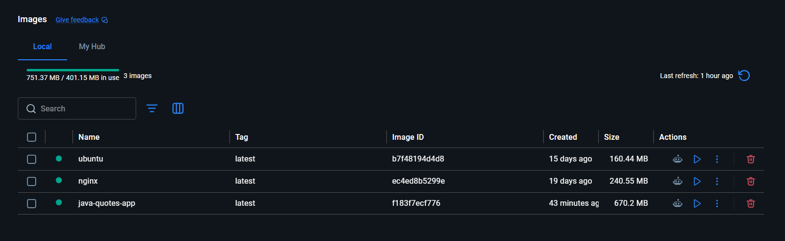
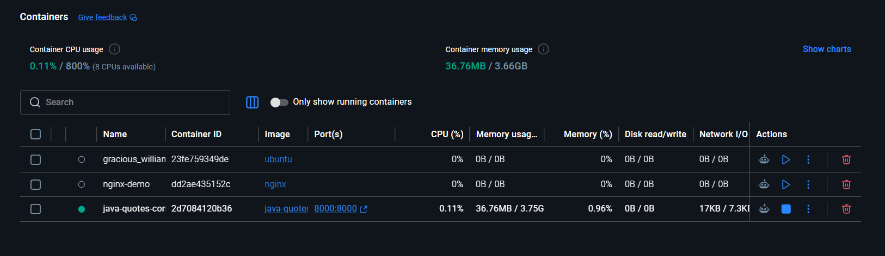
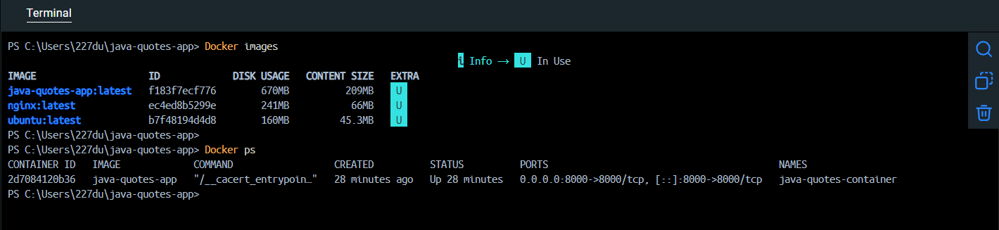

# Dockerized Java Quotes App


A lightweight Java HTTP server that serves **random motivational quotes** through a REST API. The application is fully containerized using Docker, making it easy to build, deploy, and run consistently across different environments.

---

## Features

- Lightweight Java HTTP Server
- Random motivational quotes from an external file
- REST API returning JSON responses
- Configurable `quotes.txt`
- Dockerized for easy deployment
- Cross-platform support (Windows, Linux & macOS with Docker)
- Fast startup with minimal dependencies

---

<<<<<<< HEAD
### Running Locally
1. Clone the repository:
   ```sh
   git clone https://github.com/Dushyantsharmma/dockerized-java-app.git
   cd java-quotes-app
   ```
2. Ensure `quotes.txt` exists in the project directory and contains quotes (one per line).
3. Compile and run the application:
   ```sh
   javac src/Main.java -d out
   java -cp out Main
   ```
4. The server will start on `http://localhost:8000/`.
5. Test the API using:
   ```sh
   curl http://localhost:8000/
   ```
=======
## Project Screenshots
>>>>>>> 1e56447 (Add: Updated Dockerfile and screenshots)

### Running Application



---

### Docker Image



---

### Docker Container



---

### Docker Build & Terminal



---

## Project Architecture

```text
                +-----------------------+
                |      Client           |
                | Browser / curl        |
                +-----------+-----------+
                            |
                     HTTP Request
                            |
                            ▼
                 +----------------------+
                 | Docker Container     |
                 | Java Quotes App      |
                 +-----------+----------+
                             |
                      Reads quotes
                             |
                             ▼
                      quotes.txt File
```

---

## Project Structure

```text
dockerized-java-app/
│
├── src/
│   └── Main.java
│
├── quotes.txt
├── Dockerfile
├── README.md
│
├── assets/
│   ├── running-app.png
│   ├── docker-image.png
│   ├── docker-container.png
│   └── docker-terminal.png
│
└── out/
```

---

## Prerequisites

- Java 17 or later
- Docker Desktop / Docker Engine
- Git

---

## Clone Repository

```bash
git clone https://github.com/Dushyantsharmma/dockerized-java-app.git

cd dockerized-java-app
```

---

## Running Locally

Compile the application:

```bash
javac src/Main.java -d out
```

Run:

```bash
java -cp out Main
```

Open:

```text
http://localhost:8000
```

Or test with curl:

```bash
curl http://localhost:8000
```

---

## Docker Commands

### Build Docker Image

```bash
docker build -t dockerized-java-app .
```

Verify image:

```bash
docker images
```

---

### Create Docker Container

```bash
docker run -d \
--name java-quotes-container \
-p 8000:8000 \
dockerized-java-app
```

Check running containers:

```bash
docker ps
```

View logs:

```bash
docker logs java-quotes-container
```

Stop container:

```bash
docker stop java-quotes-container
```

Start container:

```bash
docker start java-quotes-container
```

Remove container:

```bash
docker rm -f java-quotes-container
```

---

## API Endpoint

### Request

```http
GET /
```

### Example

```text
http://localhost:8000/
```

### Sample Response

```json
{
  "quote": "Success is the sum of small efforts repeated day in and day out."
}
```

---

## Customizing Quotes

Open:

```text
quotes.txt
```

Example:

```text
Dream big.
Stay hungry.
Never stop learning.
Consistency beats motivation.
Believe in yourself.
```

Restart the application after modifying the file.

---

## Technologies Used

- Java 17
- Java HTTP Server (`com.sun.net.httpserver.HttpServer`)
- Docker
- Git
- GitHub

---

## Docker Concepts Demonstrated

- Dockerfile
- Docker Images
- Docker Containers
- Port Mapping
- Image Build Process
- Container Lifecycle
- Cross-platform Deployment

---

## Author

**Dushyant Sharma**

- GitHub: https://github.com/Dushyantsharmma
- LinkedIn: https://www.linkedin.com/in/dushyantsharmma/

---

## Support

If you found this project helpful, consider giving it a **star** on GitHub.

